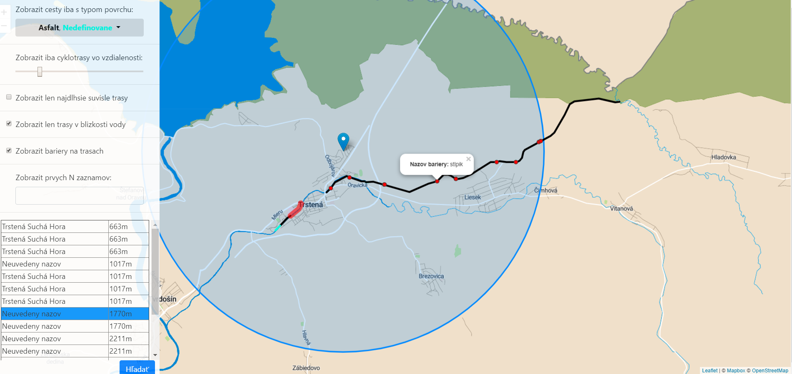

# Prehľad

Táto aplikácia umožňuje používateľovi prezerať cyklotrasy na územi Slovenskej republiky, pričom sú tieto trasy primárne rozlíšené na základe typu povrchu. Používateľ môže pomocou parametrizácie aplikácie využívať nasledovné scenáre: 
- filtrovať cyklotrasy na základe typu povrchu
- zobraziť trasy v definovanej vzdialenosti od zvoleného bodu
- zobraziť cyklotrasy v blízkosti vodných plôch
- filtrovať len trasy, ktoré sú zoradené od najdlhšej
- zobraziť prekážky nachádzajúce sa na cyklotrasách
- obmedziť vyhľadávanie na `N` záznamov
- navzájom kombinovať vyššie uvedené scenáre
- prehľadávať v tabuľke zoradené výsledky podľa vzdialenosti od používateľa

Používateľské rozhranie aplikácie môže vyzerať nasledovne:



Aplikácia sa primárne delí na dve časti, strana klienta ([webová aplikácia](#frontend)), ktorá je zodpovedná za vykresľovanie `geo` údajov a strana [servera](#backend), ktorá tieto údaje poskytuje. Komunikácia medzi stranou klienta a stranou servera je zabezpečená pomocou asynchrónnych funckií (`ajax`) implementovaných za pomoci [jQuery](https://jquery.com/).

# Frontend

Jedná sa o klasickú HTML stránku (`index.html`), ktorá za pomoci knižnice [Leaflet.js](https://leafletjs.com/) zobrazuje `geo` údaje, ktoré servuje [server](#backend). Cyklotrasy sú zobrazované v upravenej mape, ktorá bola vyhotovená pomocou editoru [Mapbox Studio](https://www.mapbox.com/mapbox-studio/). Úpravy prvkov mapy sú v podobe zvýraznenia elementov, ktoré sa zdajú byť zaujímavé z pohľadu cyklistu (zvýraznenie vodných plôch, národných parkov a vedľajších ciest).

O dynamickú časť webovej aplikácie je zodpovený [JavaScript](https://developer.mozilla.org/bm/docs/Web/JavaScript) (`js/main.js`), ktorý je importovaný v statickej stránke `index.html`. 
Celkovo je táto dynamická časť zodpovedná za:
- detekciu pozície používateľa
- zber konfigurácií parametrov na základe interakcie používateľa
- zasielanie týchto parametrov na stranu [servera](#backend)
- zobrazovanie výsledkov, ktoré [server](#backend) posiela (vo formáte [GeoJSON](http://geojson.org/))
- pridávanie popisu ku grafickým elementom (vzdialenosť, názov, atď.)

Klientska časť ďalej využíva nasledovné knižnice a závislostí:
- [jQuery](https://jquery.com/) na spracovanie údajov a asynchrónnu komunikáciu so [serverom](#backend)
- [Bootstrap](https://getbootstrap.com/) za účelom generovania responzívnych HTML elementov
- Použitie [HTML 5 Boilerplate](https://html5boilerplate.com/) ako východiskovej štruktúry HTML stránky

# Backend

Strana servera je napísaná v jazyku [PHP](http://php.net/) a nachádza sa v priečinku `server/`. Súbor `server/RequestManager.php` je implementovaný ako `Singleton` návrhového vzoru `Fasáda` a je zodpovedný za spracovanie požiadaviek [klienta](#frontend). Na základe konfigurácie parametrov [klienta](#frontend) využíva súbor `server/PersistManager.php`, ktorý je zodpovedný za parametrizované dopyty nad databázou ([PostgreSQL](https://www.postgresql.org/) s rozšírením [PostGIS](https://postgis.net/)). Dopyty sú vyvolávané ako `Prepared Statement`, kde sú dopyty oddelené od parametrov (napr. za účelom vyhnúť sa `SQL Injection`, a pod.). Súbor `server/RequestManager.php` je taktiež zodpovedný za formátovanie údajov z databázy do formátu [GeoJSON](http://geojson.org/), ktoré potom posiela na stranu [klienta](#frontend).

## Dáta

Dáta o cyklotrasách, v rámci celej Slovenskej republiky, pochádzajú z [Open Street Maps](https://download.geofabrik.de/). Údaje boli importované do databázy pomocou [osm2pgsql](https://github.com/openstreetmap/osm2pgsql). V databáze sa teda nachádzajú údaje (pokrývajúce celé Slovensko) v tabuľkách: `planet_osm_line`, `planet_osm_point`, `planet_osm_polygon` a `planet_osm_roads`.

Za účelom efektívnejšieho dopytovania údajov z databázy boli indexované nasledujúce stĺpce v tabuľkách:
- `planet_osm_line_index` - index nad geometriou `way`, ktorá sa často používa pri podmienkách a geo funkciách (defaultne)
- `planet_osm_line_index_highway` - index nad stĺpcom `highway`, nakoľko sa často pristupuje k dátam, ktoré sú cyklotrasy
- `planet_osm_line_index_surface` - index nad stĺpcom `surface`, keďže pre každý dopyt sa vyberajú len vybrané druhy povrchov 
- `planet_osm_line_index_waterway` - index nad stĺpcom `waterway`, keďže scenáre podporujú zobrazovanie cyklotrás v blízkosti vodných plôch
- `planet_osm_point_index` - index nad geometriou `way`, ktorá sa často používa pri podmienkách a geo funkciách (defaultne)
- `planet_osm_point_index_barrier` - index nad stĺpcom `barrier`, keďže scenáre podporujú zobrazovanie prekážok na trase


V súbore `server/PersistManager.php`, ktorý je zodpovedný za parametrizované dopyty nad databázou sa využívajú nasledovné geo funkcie:
- `ST_Distance` - získanie vzdialenosti trasy od používateľa, za účelom zoradenia a zobrazenia výsledkov od najbližšieho
- `ST_Length` - na zistenie dĺžky cyklotrasy
- `ST_DWithin` - na získanie cyklotrás v rámci kritérii používateľa alebo získanie cyklotrás v blízkosti vody
- `ST_Intersects` - na získanie najdlhšej súvislej trasy - rozdielne trasy, ktoré sú prepojené
- `ST_Contains` - na zistenie či sa nachádzajú prekážky na trase
- `ST_Touches` - na zistenie či sa nachádzajú prekážky na trase
- `ST_AsGeoJSON` - konverzia geometrie do [GeoJSON](http://geojson.org/) formátu
- `ST_Transform` - za účelom konverzie geometriu do iného priestorového referenčného formátu
- `ST_SetSRID` - pri vytváraní bodov, na nastavenie geometrie na inú priestorovú referenčnú hodnotu
- `ST_MakePoint` - vytváranie geometrie na základe polohy (bod) 

## API

Server poskytuje dva endpointy, ktoré na základe parametrov, teda interakcie klienta s aplikáciou, vyskladajú príslušný dopyt nad databázou.

#### Nájdi cyklotrasy na základe preferencií/konfigurácie

`GET /server/RequestManager.php?action=search`

**Príklad parametrov a query pri scenári:**
*Nájdi cyklotrasy v určitej blízkosti od definovaného stanoviska, ktoré sú určitého povrchu a nachádzajú sa v blízkosti vody*
**Parametre:**
```
{  
   "surfaceClausule":[  
      "asphalt",
      "concrete",
      "grass",
      "ground"
   ],
   "rangeDistance":"2484",
   "myPosition":[  
      "48.1486",
      "17.1077"
   ],
   "limit":"",
   "water":"true",
   "longest":"false"
}
```
**Query:**
```
SELECT
   ST_AsGeoJSON(ST_Transform(A.way, 4326)) AS geometry,
   A.surface,
   A.name,
   ST_Distance(ST_Transform(A.way, 4326), ST_SetSRID(ST_MakePoint($1, $2)::geography, 4326)) AS distance,
   A.osm_id AS id,
   ST_Length(A.way) AS length 
FROM
   planet_osm_line AS A 
   JOIN
      planet_osm_line AS water 
      ON ST_DWithin(A.way, water.way, 100) 
WHERE
   A.highway = 'cycleway' 
   AND water.waterway IS NOT NULL 
   AND 
   (
      A.surface = $3 
      OR A.surface = $4 
      OR A.surface = $5 
      OR A.surface = $6
   )
   AND ST_DWithin(ST_Transform(A.way, 4326), ST_SetSRID(ST_MakePoint($1, $2)::geography, 4326), $7) 
ORDER BY
   distance
```

**Príklad parametrov a query pri scenári:**
*Nájdi cyklotrasy v určitej blízkosti od definovaného stanoviska, ktoré sú určitého povrchu a nachádzajú sa v blízkosti vody, pričom zobraz len N najdlhších súvislých trás (súvislá trasa = súhrn trás, ktoré sú vzájomne prepojené)*
**Parametre:**
```
{  
   "surfaceClausule":[  
      "asphalt",
      "concrete",
      "grass",
      "ground"
   ],
   "rangeDistance":"2484",
   "myPosition":[  
      "48.1486",
      "17.1077"
   ],
   "limit":"7",
   "water":"true",
   "longest":"true"
}
```
**Query:**
```
WITH longest AS 
(
   SELECT
      A.osm_id,
      SUM(ST_Length(B.way)) AS length 
   FROM
      planet_osm_line AS A 
      JOIN
         planet_osm_line AS B 
         ON ST_Intersects(A.way, B.way) 
      JOIN
         planet_osm_line AS water 
         ON ST_DWithin(A.way, water.way, 100) 
   WHERE
      A.highway = 'cycleway' 
      AND B.highway = 'cycleway' 
      AND water.waterway IS NOT NULL 
      AND 
      (
         A.surface = $3 
         OR A.surface = $4 
         OR A.surface = $5 
         OR A.surface = $6
      )
      AND ST_DWithin(ST_Transform(A.way, 4326), ST_SetSRID(ST_MakePoint($1, $2)::geography, 4326), $7) 
   GROUP BY
      A.osm_id 
   ORDER BY
      length DESC LIMIT $8
)
SELECT
   ST_AsGeoJSON(ST_Transform(C.way, 4326)) AS geometry,
   C.surface,
   C.name,
   ST_Distance(ST_Transform(C.way, 4326), ST_SetSRID(ST_MakePoint($1, $2)::geography, 4326)) AS distance,
   C.osm_id AS id,
   ST_Length(C.way) AS length,
   C.way,
   C.highway 
FROM
   planet_osm_line AS A 
   JOIN
      longest AS B 
      ON B.osm_id = A.osm_id 
   JOIN
      planet_osm_line AS C 
      ON ST_Intersects(A.way, C.way) 
WHERE
   C.highway = 'cycleway' 
ORDER BY
   distance
```

#### Nájdi prekážky na cyklotrasách v kontexte preferencií/konfigurácie

`GET /server/RequestManager.php?action=findBarriers`

**Príklad parametrov a query pri scenári:**
*Nájdi bariéry pre cyklotrasy v určitej blízkosti od definovaného stanoviska, ktoré sú určitého povrchu a nachádzajú sa v blízkosti vody*
**Parametre:**
```
{  
   "surfaceClausule":[  
      "asphalt",
      "concrete",
      "grass",
      "ground"
   ],
   "rangeDistance":"2484",
   "myPosition":[  
      "48.1486",
      "17.1077"
   ],
   "limit":"",
   "water":"true",
   "longest":"false"
}
```
**Query:**
```
SELECT
   ST_AsGeoJSON(ST_Transform(A.way, 4326)) AS geometry,
   A.barrier AS name,
   ST_Distance(ST_Transform(A.way, 4326), ST_SetSRID(ST_MakePoint($1, $2)::geography, 4326)) AS distance 
FROM
   planet_osm_point AS A 
   JOIN
      planet_osm_line AS B 
      ON (ST_Contains(B.way, A.way) 
      OR ST_Touches(A.way, B.way)) 
   JOIN
      planet_osm_line AS water 
      ON ST_DWithin(B.way, water.way, 100) 
WHERE
   A.barrier IS NOT NULL 
   AND B.highway = 'cycleway' 
   AND water.waterway IS NOT NULL 
   AND 
   (
      B.surface = $3 
      OR B.surface = $4 
      OR B.surface = $5 
      OR B.surface = $6
   )
   AND ST_DWithin(ST_Transform(A.way, 4326), ST_SetSRID(ST_MakePoint($1, $2)::geography, 4326), $7)
```

**Príklad parametrov a query pri scenári:**
*Nájdi bariéry pre cyklotrasy v určitej blízkosti od definovaného stanoviska, ktoré sú určitého povrchu a nachádzajú sa v blízkosti vody, pričom zobraz len `N` najdlhších súvislých trás (súvislá trasa = súhrn trás, ktoré sú vzájomne prepojené)*
**Parametre:**
```
{  
   "surfaceClausule":[  
      "asphalt",
      "concrete",
      "dirt",
      "grass"
   ],
   "rangeDistance":"4023",
   "myPosition":[  
      "48.1486",
      "17.1077"
   ],
   "limit":"6",
   "water":"true",
   "longest":"true"
}
```
**Query:**
```
WITH longest AS 
(
   SELECT
      A.osm_id,
      SUM(ST_Length(B.way)) AS length 
   FROM
      planet_osm_line AS A 
      JOIN
         planet_osm_line AS B 
         ON ST_Intersects(A.way, B.way) 
      JOIN
         planet_osm_line AS water 
         ON ST_DWithin(A.way, water.way, 100) 
   WHERE
      A.highway = 'cycleway' 
      AND B.highway = 'cycleway' 
      AND water.waterway IS NOT NULL 
      AND 
      (
         A.surface = $3 
         OR A.surface = $4 
         OR A.surface = $5 
         OR A.surface = $6
      )
      AND ST_DWithin(ST_Transform(A.way, 4326), ST_SetSRID(ST_MakePoint($1, $2)::geography, 4326), $7) 
   GROUP BY
      A.osm_id 
   ORDER BY
      length DESC LIMIT $8
)
,
longestIntersect AS 
(
   SELECT
      ST_AsGeoJSON(ST_Transform(C.way, 4326)) AS geometry,
      C.surface,
      C.name,
      ST_Distance(ST_Transform(C.way, 4326), ST_SetSRID(ST_MakePoint($1, $2)::geography, 4326)) AS distance,
      C.osm_id AS id,
      ST_Length(C.way) AS length,
      C.way,
      C.highway 
   FROM
      planet_osm_line AS A 
      JOIN
         longest AS B 
         ON B.osm_id = A.osm_id 
      JOIN
         planet_osm_line AS C 
         ON ST_Intersects(A.way, C.way) 
   WHERE
      C.highway = 'cycleway' 
   ORDER BY
      distance
)
SELECT
   ST_AsGeoJSON(ST_Transform(A.way, 4326)) AS geometry,
   A.barrier AS name,
   ST_Distance(ST_Transform(A.way, 4326), ST_SetSRID(ST_MakePoint($1, $2)::geography, 4326)) AS distance 
FROM
   planet_osm_point AS A 
   JOIN
      longestIntersect AS B 
      ON (ST_Contains(B.way, A.way) 
      OR ST_Touches(A.way, B.way)) 
   JOIN
      planet_osm_line AS water 
      ON ST_DWithin(B.way, water.way, 100) 
WHERE
   A.barrier IS NOT NULL 
   AND B.highway = 'cycleway'
```

### Odpoveď

[Server](#backend) vracia odpoveď vo formáte `JSON`, pričom je veľmi podobná formátu [GeoJSON](http://geojson.org/) (do tohto formátu sa vyskladáva na strane servera), konkrétne pole týchto objektov. Navyše pridáva informáciu o úspešnosti dopytu:
```
{  
   "data":[  
      {
         "type":"Feature",
         "properties":{  
            "name":"Cyklotrasa Trnava",
            "surface":"paved",
            "distance":"442.08916529",
            "id":"375724068",
            "length":"29.9826899000245"
         },
         "geometry":{  
            "type":"LineString",
            "coordinates":[  
               [  
                  17.1114169,
                  48.145295999903
               ],
               [  
                  17.1111752,
                  48.145375299903
               ]
            ]
         }
      },
      ...
   ],
   "error":false
}
```
